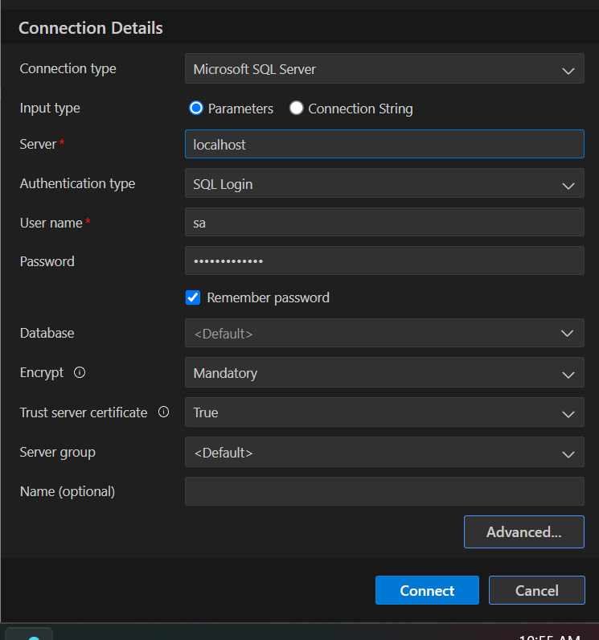

# Install sqlserver in docker container

```ps
docker pull mcr.microsoft.com/mssql/server
```

**List docker images**

```ps
docker images
```

**SETUP a sqlserver instance**

```ps
docker run -e "ACCEPT_EULA=Y" -e "MSSQL_SA_PASSWORD=MyPassword#sa" -p 1433:1433 --name sqlserver -d mcr.microsoft.com/mssql/server:2022-latest
```

**Run or Stop the container**

```ps
docker start sqlserver
docker stop sqlserver
```

**List docker executing container**
```ps
docker ps
```

**Optional: install AZURE DATA STUDIO**

Azure Data Studio is a cross-platform database tool for data professionals who use SQL Server, Azure SQL Database, and other data sources. It offers a modern editor experience with IntelliSense, code snippets, source control integration, and an integrated terminal. It's perfect for running queries, managing servers, and even developing and deploying your database projects.


